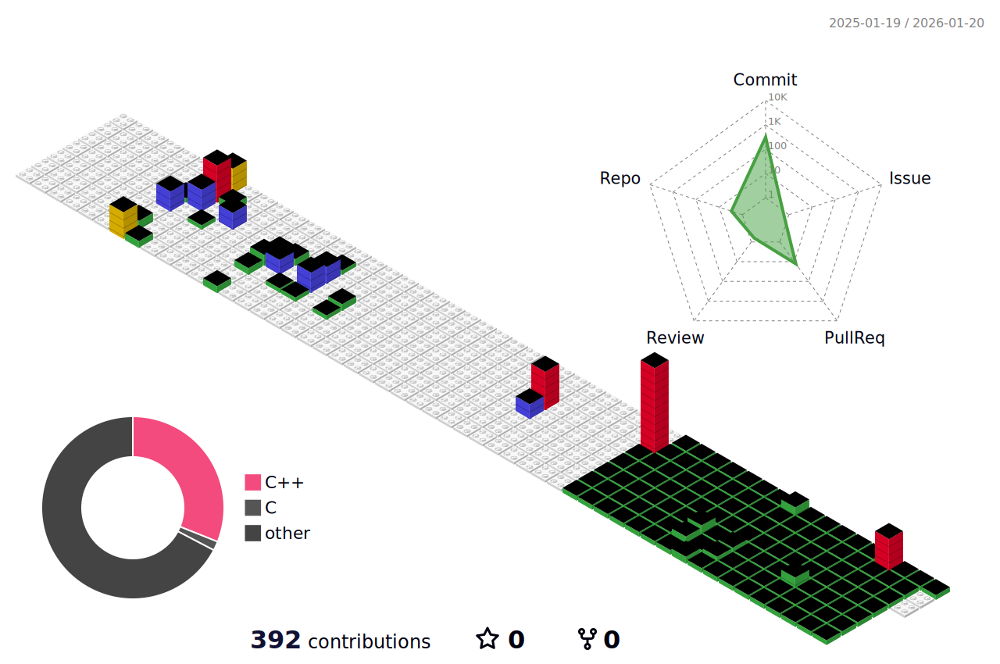

## ✍️ About me
**C++에 대한 깊은 이해와 로우레벨 그래픽스 지식**을 기반으로 복잡한 문제의 **본질을 해결**하고, 기존 로직의 **한계를 넘어서는 솔루션**을 구현해내는 게임 프로그래머 **강수현**입니다.

  
  

## 💪 Skills
### 📚 Languages
  

### 🎮 Engines
 

### 🎨 Graphics
 
 

### 💻 Platforms
  

### ☁️ Server & Cloud
 
 

### 🛠 Tools
  
 
  

## 📞 Contacts
  

## 🌳Contributions

  

  

